**Assignment-1**

Shelly Anissa

B210434CS

**INTRODUCTION**

NITC-RISC24 is a 16 bit processor, which is capable of executing
instructions of format R, I and J. The encoding of each instruction is
shown below.

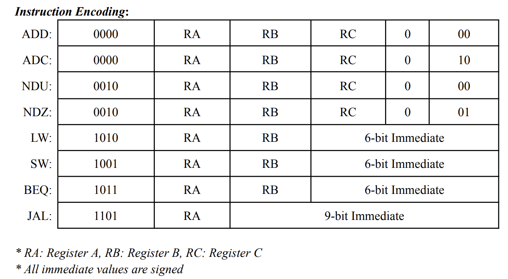{width="6.184027777777778in"
height="3.3993055555555554in"}

**MODULES**

**1.
ALU**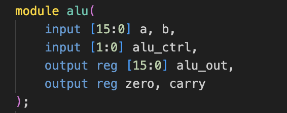{width="3.557638888888889in"
height="1.4076388888888889in"}

The ALU takes in two operands. The operation to be performed is dictated
by the alu_ctrl signal. To accommodate all the 8 instructions the ALU
need only perform three operations ADD, SUBTRACT and NAND.

  -----------------------------------------------------------------------
  **ALU_CTRL**            **ALU OPERATION**       **INSTRUCTION**
  ----------------------- ----------------------- -----------------------
  **00**                  ADD                     ADD, ADC, LW, SW

  **01**                  NAND                    NDU, NDZ

  10                      SUB                     BEQ
  -----------------------------------------------------------------------

**2. INSTRUCTION
MEMORY**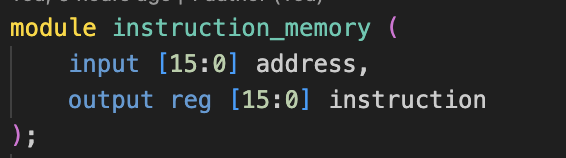{width="3.9305555555555554in"
height="1.0972222222222223in"}

This module is responsible for reading the instructions from file onto
instruction memory upon initialisation. The output of the module would
be the instruction present at the specified address.

**3. DATA
MEMORY**{width="3.736111111111111in"
height="1.8333333333333333in"}

The module data memory is responsible for writing or reading from memory
based on the input signals clk, MemWrite and MemRead. The data to be
written is present in the wd register and data read from memory would be
present in rd register.

**4. PROGRAM
COUNTER**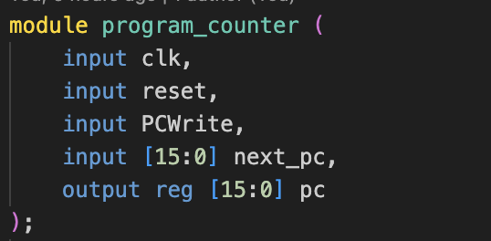{width="3.698611111111111in"
height="1.8152777777777778in"}

PCWrite signal enables the update of pc with the value next_pc. If the
reset signal is set to high, program counter would be assigned the value
0 and thus resetting the program execution.

**5. NEXT PC LOGIC**

The next pc logic is computed differently for different values of the
Branch, Zero and JAL input signals.

A.  JAL: next_pc = pc + sign_extended offset ( 6 bits )

B.  BRANCH ( zero flag is also set ) : next_pc = pc + sign_extended
    offset ( 9 bits )

C.  DEFAULT: next_pc = pc + 1

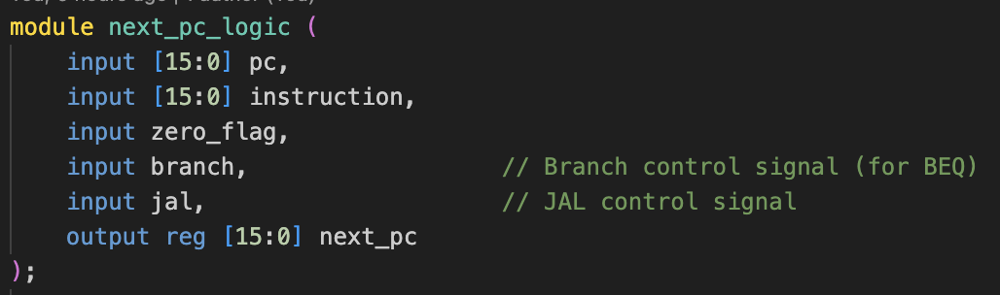{width="6.6930555555555555in"
height="1.9791666666666667in"}**6. REGISTER
FILE**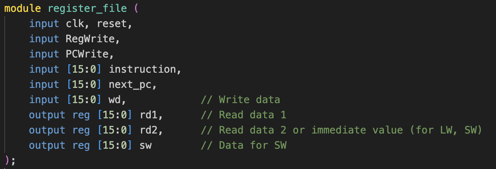{width="6.6930555555555555in"
height="2.292361111111111in"}

The source and destination registers are determined from the instruction
based on the opcode. Registers rd1 and rd2 have the contents of source
registers in R type instruction and register content and immediate value
in the case of I type instruction. Register sw contains the word to be
written to memory for store word instruction.

RegWrite enables writing onto register, excluding R0.

PCWrite signal is used to update R0 with the program counter value.

**7. CONTROL
UNIT**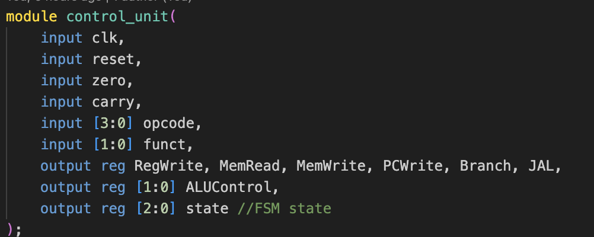{width="5.9847222222222225in"
height="2.388888888888889in"}

The control unit is responsible for generating the control signals
namely RegWrite, MemRead, MemWrite, PCWrite, JAL, Branch, ALUControl.

The following encoding is used to denote the phase of the multi cycle
execution:

IF = 3\'b000, ID = 3\'b001, EX = 3\'b010, MEM = 3\'b011, WB = 3'b100;

Given below is the state transition
logic.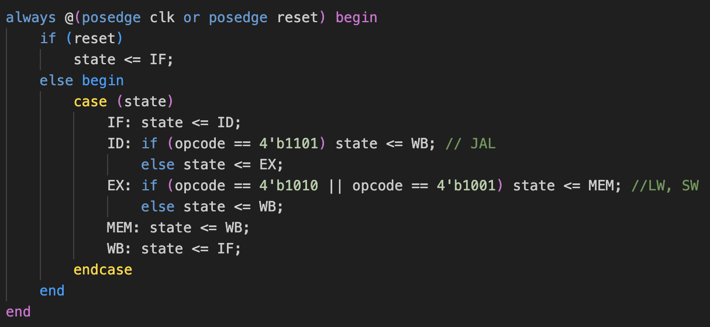{width="6.6930555555555555in"
height="3.0875in"}

The control signals for different phases of an I-Type instruction **LW
R1 R2 Imm**

  -----------------------------------------------------------------------------------------------------------
  **PHASE**   **MEMWRITE**   **MEMREAD**   **REGWRITE**   **PCWRITE**   **JAL**   **BRANCH**   **ALU_CTRL**
  ----------- -------------- ------------- -------------- ------------- --------- ------------ --------------
  **IF**      0              0             0              1             0         0            xx

  **ID**      0              0             0              0             0         0            xx

  **EX**      0              0             0              0             0         0            00

  **MEM**     0              1             0              0             0         0            00

  **WB**      0              0             1              0             0         0            00
  -----------------------------------------------------------------------------------------------------------

**8.
NITC_RISC24_PROCESSOR**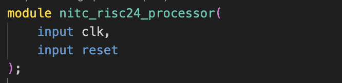{width="3.915277777777778in"
height="0.9520833333333333in"}

This top level module is responsible for instantiating all the
submodules, declaring wires and registers. It multiplexes the write data
for register file as follows:

A.  LW: rw of data_memory

B.  JAL: pc + 1

C.  DEFAULT: alu_out

**INSTRUCTION RUN**

Given below is the sample run of the processor with the contents of
instruction file being as shown.
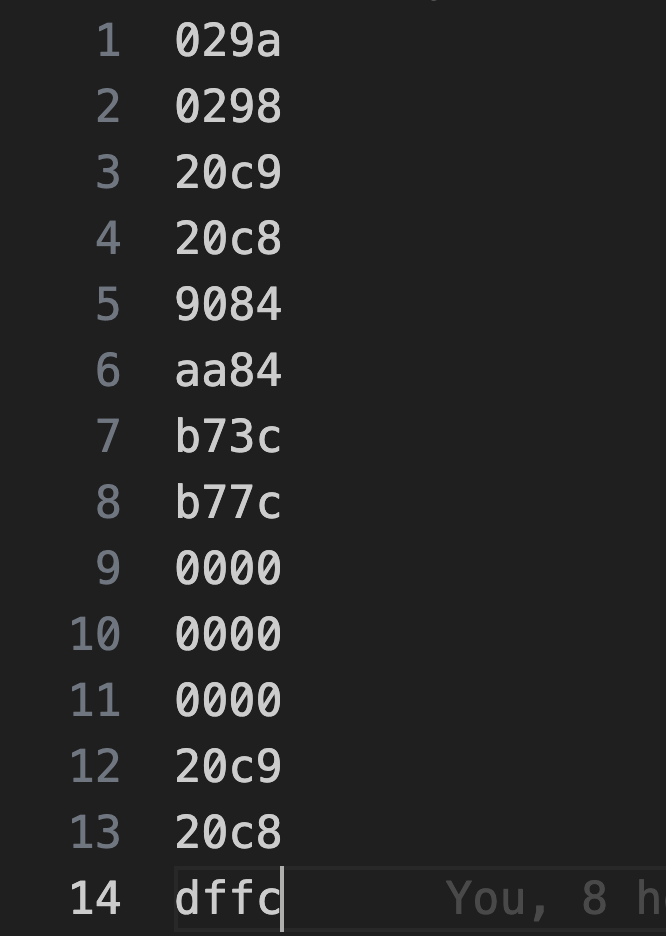{width="2.4166666666666665in"
height="3.3958333333333335in"}

The state of the registers at the time of fetch of each instruction is
displayed alongside the time instant. The instruction under execution is
highlighted within cyan block. The line separations

'\-\-\--' indicate the number of cycles/stages elapsed within the
execution of the instruction. The clock signal toggles every 10 ns. That
is a clock cycle is 20 ns long. Register R1 is initialised with the
value 4, whereas all the other registers are 0.

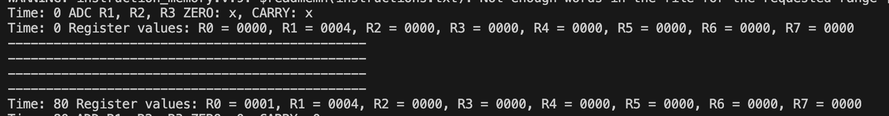{width="6.69251968503937in"
height="0.8771653543307086in"}**1. ADC**

alu_out = R1 + R2 =\> 4 + 0 =\> 4

However the value is not written back to R3 since carry flag is not set.

The program counter R0 is incremented.

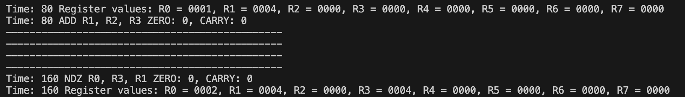{width="6.69251968503937in"
height="0.9598425196850394in"}**2. ADD**

alu_out = R1 + R2 =\> 4

The value 4 is written back to R3.

It could also be noticed that the program counter value at R0 is also
updated.

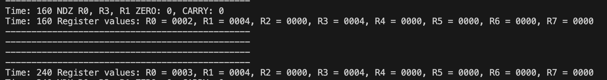{width="6.69251968503937in"
height="0.8937007874015748in"}**3. NDZ**

alu_out = \~( R0 & R3 ) =\> \~( 0000 & 0003 ) =\> ffff

However write back to R1 does not happen since Zero flag is not set

Program counter updated to 3

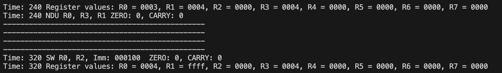{width="6.69251968503937in"
height="0.988976377952756in"}**4. NDU**

alu_out = \~( R0 & R3 ) =\> \~( 0000 & 0003 ) =\> ffff

ffff is written back to R1

Program counter updated to 4

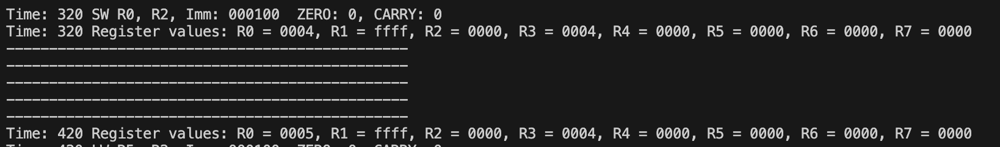{width="6.69251968503937in"
height="0.988976377952756in"}**5. SW**

alu_out = R2 + sign_extend(000100) =\> 4

Contents of R0 ie 0004 is written at data address 16'b 4

It has to be also noted that the number of cycles/stages elapsed here is
5 unlike 4 in R type instructions, due to the MEM stage present.

Program counter updated to 5

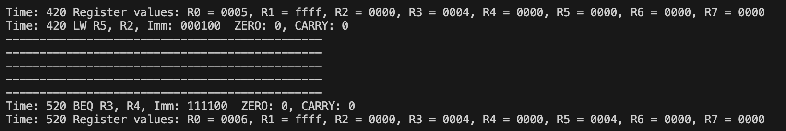{width="6.69251968503937in"
height="1.1192913385826773in"}**6. LW**

Data stored at address 4 in previous instruction is fetched and written
onto R5

alu_out = R2 + sign_extend(00100) =\> 4

5 written onto R5

Program counter incremented to 6

The instruction goes through 5 stages indicated by the number of dashed
lines.

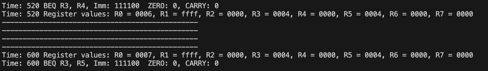{width="6.69251968503937in"
height="0.988976377952756in"}**7. BEQ ( not taken )**

alu_out = R3 - R4 =\> 0004 - 0000 =\> 0004

Thus zero flag is not set and branch is not taken.

Program counter incremented as always.

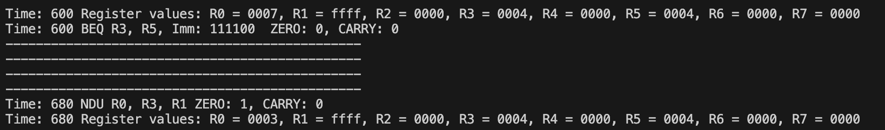{width="6.69251968503937in"
height="0.988976377952756in"}**8. BEQ ( taken )**

alu_out = R3 - R5 =\> 0004 - 0004 =\> 0000

Thus zero flag is set and branch is taken.

Branch address = PC + sign_extend(offset) =\> 0007 + fffc(two's comp of
-4) =\> 3

PC is set to the branch target 3

{width="6.69251968503937in"
height="0.7429133858267717in"}**9. JAL**

Jump address = PC + sign_extend(offset) =\> 000d + fffc(two's comp of
-4) =\> 9

Link address = PC + 1 =\> d + 1 =\> e

Link address is written back to R7
